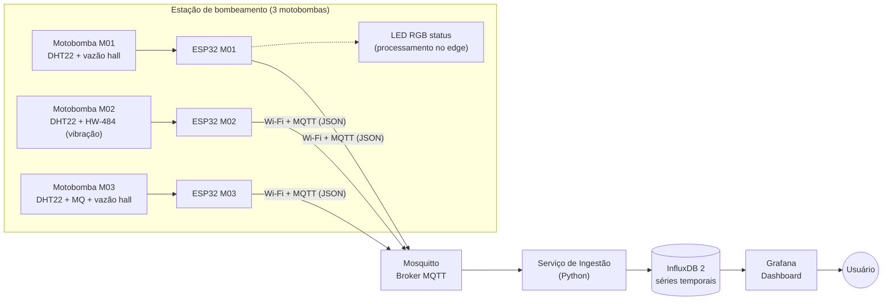

# Mini Central de Monitoramento IoT

Sistema de monitoramento industrial em escala didática de uma **estação de
bombeamento de água** com três conjuntos motobomba. Três ESP32 (uma por
máquina) publicam telemetria (temperatura do motor, vibração, corrente,
rotação e vazão) via MQTT. Os dados são ingeridos por um serviço Python,
armazenados no InfluxDB e visualizados em tempo real no Grafana.
Tudo roda localmente, em contêineres Docker, sem depender de internet.

> Projeto da disciplina **Hardware Configurável e IoT** da UNAERP.

## Arquitetura



Cada componente é justificado em [`docs/02-arquitetura.md`](docs/02-arquitetura.md).

## Estrutura do repositório

```
.
├── docs/                    # Documentação (requisitos, arquitetura, modelo de dados, ...)
├── firmware/                # Projeto PlatformIO único com 3 environments (maquina01/02/03)
│   └── src/                 # Código C++ compartilhado; ID e sensores via build flags
├── backend/
│   ├── ingest/              # Serviço MQTT → InfluxDB (roda no Docker Compose)
│   ├── simulator/           # Simulador das 3 máquinas (500+ registros, anomalias)
│   └── tools/               # Exportação da base de dados em CSV
├── infra/
│   ├── docker-compose.yml   # Mosquitto + InfluxDB + Grafana + ingestão
│   ├── mosquitto/           # Configuração do broker
│   └── grafana/             # Datasource, dashboard e alertas provisionados como código
└── scripts/                 # Atalhos PowerShell (subir stack, simular, exportar)
```

## Como executar

Pré-requisitos: [Docker Desktop](https://www.docker.com/products/docker-desktop/)
e [Python 3.11+](https://www.python.org/). Para gravar as ESP32, também
[PlatformIO](https://platformio.org/).

```powershell
Copy-Item infra/.env.example infra/.env            # crie e ajuste as senhas
docker compose --project-directory infra up -d     # sobe broker, banco, back-end e dashboard
python backend/simulator/simulador.py --backfill 50m --intervalo 10 --anomalia
```

Abra <http://localhost:3000> com o usuário e a senha do `infra/.env`. O
dashboard, a conexão com o banco e os alertas já sobem configurados.

Passo a passo completo, incluindo instalação e solução de problemas:
[`docs/11-comecando-do-zero.md`](docs/11-comecando-do-zero.md). Para montar o
hardware: [`docs/09-guia-de-bancada.md`](docs/09-guia-de-bancada.md) e
[`docs/10-esquema-eletrico.md`](docs/10-esquema-eletrico.md).

## Contrato de dados

Payload publicado em `fabrica/maquinas/<ID>/telemetria`:

```json
{
  "machine": "M01",
  "temperature": 72.4,
  "vibration": 2.8,
  "current": 8.2,
  "rotation": 3510,
  "timestamp": "2026-08-20T17:00:00"
}
```

Campos extras opcionais: `flow` (vazão em L/min, sensor hall nas M01/M03),
`humidity` (umidade da casa de bombas, indício de vazamento), `gas` (M03),
`status` (0=normal, 1=atenção, 2=crítico, calculado no edge). Detalhes em
[`docs/03-modelo-de-dados.md`](docs/03-modelo-de-dados.md).

## Documentação

Os documentos são numerados na ordem de leitura. De **01 a 08** acompanham a
entrega, cada um alimentando uma seção do documento técnico. De **09 a 11** são
guias práticos de uso.

| Documento | Conteúdo |
|---|---|
| [01-requisitos.md](docs/01-requisitos.md) | Requisitos da atividade e rastreabilidade |
| [02-arquitetura.md](docs/02-arquitetura.md) | Desafio 1: diagrama e justificativa de cada componente |
| [03-modelo-de-dados.md](docs/03-modelo-de-dados.md) | Tópicos MQTT, schema InfluxDB, retenção |
| [04-dashboard.md](docs/04-dashboard.md) | Desafio 3: os 7 painéis e suas consultas |
| [05-analise.md](docs/05-analise.md) | Desafio 4: as 10 perguntas de análise |
| [06-seguranca.md](docs/06-seguranca.md) | Segurança da solução |
| [07-testes.md](docs/07-testes.md) | Plano e evidências de testes |
| [08-documento-tecnico.md](docs/08-documento-tecnico.md) | Montagem do documento final de entrega |
| [09-guia-de-bancada.md](docs/09-guia-de-bancada.md) | Roteiro de montagem e operação no dia da apresentação |
| [10-esquema-eletrico.md](docs/10-esquema-eletrico.md) | Ligação pino a pino das três placas e divisores de tensão |
| [11-comecando-do-zero.md](docs/11-comecando-do-zero.md) | Do clone ao dashboard funcionando, para quem nunca rodou o projeto |

## Equipe

| Integrante | Responsabilidade |
|---|---|
| _preencher_ | _preencher_ |
