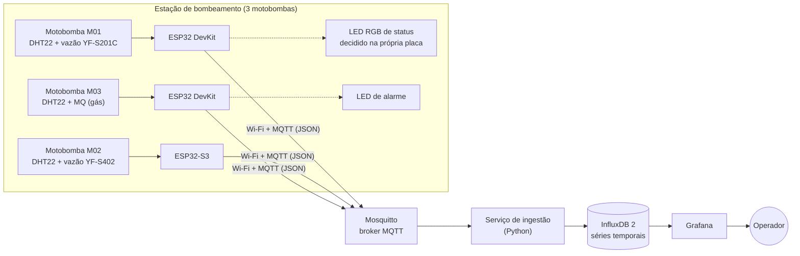

# Mini Central de Monitoramento IoT

Monitoramento de uma estação de bombeamento de água com três conjuntos
motobomba, em escala de bancada. Cada máquina tem uma ESP32 que lê os sensores,
classifica a condição ali mesmo na placa e publica a telemetria por MQTT. Um
serviço em Python recebe, valida e grava no InfluxDB; o Grafana mostra.

Roda inteiro no notebook, em contêineres Docker, sem internet — o que importa
no dia da apresentação, em que a rede da sala não é garantida.

> Disciplina Hardware Configurável e IoT, UNAERP.

## Arquitetura



Por que cada peça é essa e não outra: [`docs/02-arquitetura.md`](docs/02-arquitetura.md).

## Estrutura do repositório

```
.
├── docs/                    # Documentação numerada na ordem de leitura
├── firmware/                # PlatformIO, um projeto só com 3 environments
│   └── src/                 # C++ compartilhado; ID e sensores vêm de build flags
├── backend/
│   ├── ingest/              # MQTT → InfluxDB (sobe no Docker Compose)
│   ├── simulator/           # Simulador das 3 máquinas, também é o plano B da demo
│   └── tools/               # Exportação da base em CSV
├── infra/
│   ├── docker-compose.yml   # Mosquitto + InfluxDB + Grafana + ingestão
│   ├── mosquitto/           # Configuração do broker
│   └── grafana/             # Datasource, dashboard e alertas versionados
└── scripts/                 # Atalhos PowerShell (subir, simular, exportar)
```

## Como executar

Precisa de [Docker Desktop](https://www.docker.com/products/docker-desktop/) e
[Python 3.11+](https://www.python.org/). Para gravar as ESP32, também
[PlatformIO](https://platformio.org/).

```powershell
Copy-Item infra/.env.example infra/.env            # e troque as senhas
docker compose --project-directory infra up -d     # broker, banco, ingestão e dashboard
python backend/simulator/simulador.py --backfill 50m --intervalo 10 --anomalia
```

Abra <http://localhost:3000> com o usuário e a senha do `infra/.env`. O
dashboard, a conexão com o banco e os alertas já sobem prontos — ninguém
precisa importar nada.

Não é preciso ter nenhuma ESP32 para isso funcionar: o simulador publica as
três máquinas. O passo a passo completo, incluindo instalação e o que fazer
quando dá errado, está em
[`docs/11-comecando-do-zero.md`](docs/11-comecando-do-zero.md). Para montar o
hardware: [`docs/09-guia-de-bancada.md`](docs/09-guia-de-bancada.md) e
[`docs/10-esquema-eletrico.md`](docs/10-esquema-eletrico.md).

## Contrato de dados

Publicado em `fabrica/maquinas/<ID>/telemetria`:

```json
{
  "machine": "M01",
  "temperature": 72.4,
  "vibration": 2.8,
  "current": 8.2,
  "rotation": 3510,
  "timestamp": "2026-08-20T17:00:00"
}
```

Os quatro sinais e o timestamp vêm do enunciado. Acrescentamos campos
opcionais: `flow` (vazão em L/min, sensor hall na M01 e na M02), `humidity`
(umidade da casa de bombas, que denuncia vazamento), `gas` (M03), `status`
(0 normal, 1 atenção, 2 crítico, calculado na placa) e `fonte`, que diz se a
leitura veio de sensor ou de simulação. Detalhes em
[`docs/03-modelo-de-dados.md`](docs/03-modelo-de-dados.md).

## Documentação

Os documentos são numerados na ordem de leitura. De 01 a 08 acompanham a
entrega, cada um virando uma seção do documento técnico. De 09 a 11 são de uso
prático, para montar e rodar.

| Documento | Conteúdo |
|---|---|
| [01-requisitos.md](docs/01-requisitos.md) | Requisitos da atividade e onde cada um é atendido |
| [02-arquitetura.md](docs/02-arquitetura.md) | Desafio 1: diagrama e escolha de cada componente |
| [03-modelo-de-dados.md](docs/03-modelo-de-dados.md) | Tópicos MQTT, schema do InfluxDB, faixas e retenção |
| [04-dashboard.md](docs/04-dashboard.md) | Desafio 3: os painéis, as consultas e os alertas |
| [05-analise.md](docs/05-analise.md) | Desafio 4: as 10 perguntas de análise |
| [06-seguranca.md](docs/06-seguranca.md) | O que protegemos e o que faltaria em produção |
| [07-testes.md](docs/07-testes.md) | Plano de testes e o que já foi verificado |
| [08-documento-tecnico.md](docs/08-documento-tecnico.md) | Como montar o documento final |
| [09-guia-de-bancada.md](docs/09-guia-de-bancada.md) | Roteiro do dia: montar, gravar, apresentar |
| [10-esquema-eletrico.md](docs/10-esquema-eletrico.md) | Ligação pino a pino das três placas |
| [11-comecando-do-zero.md](docs/11-comecando-do-zero.md) | Do clone ao dashboard, para quem nunca rodou |

## Equipe

| Integrante | Responsabilidade |
|---|---|
| _preencher_ | _preencher_ |
