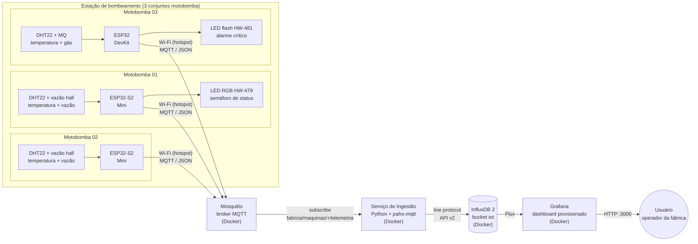

# 02 - Arquitetura (Desafio 1)

## Diagrama

## Justificativa de cada componente

### 1. Sensores

| Sensor | Papel | Justificativa |
|---|---|---|
| **DHT22/AM2302** (todas) | Temperatura do motor (+ umidade da casa de bombas) | Sensor digital calibrado, 1 fio de dados, biblioteca madura. Um por ESP32, espelhando a sugestão do professor ("um BME280 por ESP32"). A umidade é bônus com significado no cenário: umidade alta = indício de vazamento na casa de bombas. |
| **MQ** (M03) | Gás/qualidade do ar | Sinal de segurança escolhido pelo grupo (permitido pelo enunciado); monitora acúmulo de gases na casa de bombas: segurança de espaço confinado, preocupação real em estações de bombeamento. |
| **Sensor de vazão hall** (M01 e M02) | Vazão (L/min) | Turbina com sensor hall gera pulsos proporcionais à vazão. É o principal indicador de processo de uma bomba: queda indica obstrução ou cavitação, zero indica operação a seco. Fecha o par causa/efeito com a corrente do motor. |

Sinais sem sensor físico (corrente, rotação e vibração em todas; vazão na M03) são
**simulados no próprio ESP32** com variação realista e injeção de anomalias,
prática permitida pelo enunciado e comum em gêmeos digitais/bancadas de teste.
A corrente simulada modela a carga do motor (detecção de operação a seco) e a
rotação usa valores reais de motor de 2 polos (~3500 RPM).

### 2. Dispositivo IoT: ESP32 (×3)

Microcontrolador com Wi-Fi integrado, ADC de 12 bits, baixo custo e ecossistema
Arduino/PlatformIO. Uma ESP32 **por máquina** reproduz a topologia real de
fábrica (um nó de aquisição por ativo) e garante a pontuação máxima (opção C).
O ESP32 também faz **processamento de borda**: classifica cada leitura em
normal/atenção/crítico e aciona os LEDs de status localmente, sem depender da
nuvem.

### 3. Comunicação: Wi-Fi + MQTT (Mosquitto)

MQTT é o padrão de fato em IoT: leve (ideal para microcontroladores), modelo
publish/subscribe que desacopla dispositivos do back-end, suporta QoS e escala
para muitos dispositivos. O broker **Eclipse Mosquitto** é open source, leve e
roda em contêiner. Payload em **JSON** segue o contrato definido no enunciado.
A rede é o **hotspot do notebook** (recomendação do professor), eliminando a
dependência do Wi-Fi da universidade.

### 4. Back-end: Serviço de ingestão (Python)

Assina `fabrica/maquinas/+/telemetria`, **valida** o JSON, calcula o status
quando ausente, enriquece com metadados (fonte real/simulada) e grava no banco.
Separar ingestão do banco reproduz a camada de back-end profissional: é o ponto
para validação de esquema, tratamento de erros, transformação e futuras regras
de negócio (alertas, agregações).

### 5. Banco: InfluxDB 2

Banco de **séries temporais**, otimizado exatamente para telemetria: ingestão
rápida, compressão por coluna, consultas por janela de tempo (Flux), políticas
de **retenção** nativas e integração de primeira classe com Grafana. Um banco
relacional funcionaria, mas séries temporais são o ajuste natural do problema.

### 6. Dashboard: Grafana

Ferramenta líder de observabilidade, citada no enunciado. Painéis interativos,
thresholds coloridos, alertas e provisionamento **como código** (datasource e
dashboard versionados no repositório: infraestrutura reprodutível em qualquer
notebook do grupo).

### 7. Usuário

O operador/supervisor da estação de bombeamento consome o dashboard: acompanha
os sinais em tempo real, identifica tendências (aquecimento, cavitação, queda
de vazão implícita) e reage aos alertas (motobombas fora da condição normal).
É o destinatário final de toda a cadeia de valor do dado.

## Fluxo do dado (resumo)

1. Sensor lê grandeza física (ou o firmware gera o sinal simulado);
2. ESP32 monta o JSON, classifica o status (edge) e publica via MQTT;
3. Mosquitto roteia a mensagem para os assinantes;
4. Ingestão valida e grava no InfluxDB (timestamp preservado);
5. Grafana consulta o InfluxDB e renderiza os painéis;
6. Usuário monitora e decide.

## Decisões e alternativas consideradas

| Decisão | Alternativa | Por que ficamos com a escolhida |
|---|---|---|
| MQTT | HTTP REST | Menor overhead, pub/sub desacoplado, padrão industrial IoT |
| InfluxDB | PostgreSQL | Otimização nativa para séries temporais e retenção |
| Serviço Python próprio | Telegraf/Node-RED | Código explícito e didático, evidencia a camada de back-end exigida |
| Docker Compose | Instalação manual | Stack reprodutível em um comando, igual em qualquer máquina |
| Tudo local no notebook | Hospedar na nuvem | A demonstração precisa rodar offline no hotspot, sem depender de internet nem gerar custo; a arquitetura é a mesma e subiria para um servidor sem alterar código |
